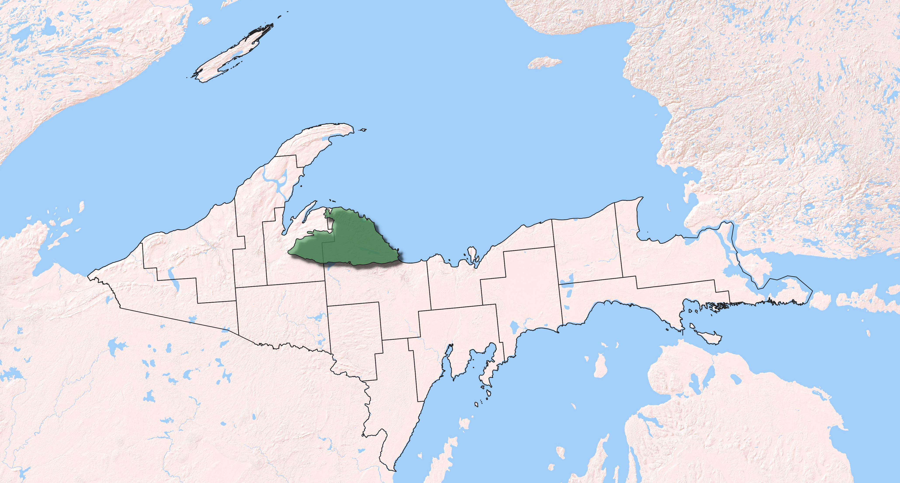

```{r setup, include=FALSE}
library(tufte)
library(readr)
library(tidyverse)
library(ggplot2)
library(plotly)
library(scales)
library(knitr)
library(ggthemr)
library(chorddiag)
library(igraph)
library(tidygraph)
library(networkD3)
library(dplyr)
library(RColorBrewer)
library(colorRamps)
library(treemap)
library(tidyverse)
library(sunburstR)
library(igraph)
library(chorddiag)
library(tidygraph)
# invalidate cache when the tufte version changes
knitr::opts_chunk$set(tidy = FALSE, cache.extra = packageVersion('tufte'))
options(htmltools.dir.version = FALSE)
```


# Change happens


<video width="400" height="300" controls>
  <source src="MH1984_2018.mp4" type="video/mp4">
</video>

This 8 second video was recorded from Google Maps, and shows that even in the relatively remote Michigamme Highlands there has been change over the last few decades. Some of the change is seasonal, some from camera angles.  Some change is not natural.  Most notably you see the Eagle Mine pop up.  Using fun communications tools we can show change, present basic data and enable decision making.  

<br>

# Overall goals

We want to help MIFO better conserve the Michigamme Highlands through science-based communications support.  More specifically we aim to:

* analyze LANDFIRE and other datasets to help characterize forest conditions 
* develop beautiful maps, interactive charts and other tools
* collaborate with MIFO staff to craft meaningful messages

We will work to **compliment** current MIFO efforts, recognizing a fair amount of science and communications work has already been completed.

Additionally, by bringing in the Conservation Data Lab we will mentor students.

```{r, echo =FALSE, fig.margin = TRUE, fig.cap="Michigamme Highlands highlighted in green."}

```

# Audiences
We aim for any output to be simple and easy to digest.  Audiences may include internal non-science TNC staff, board members, potential donors and the public as appropriate.  

# Potential messages
There are multiple decisions facing MIFO regarding the Michigamme Highlands--questions around "how many acres?", "which acres?", "how much should we pay?" and "what would we need to do with the acres we conserve?".  Further, there are significant fundraising needs and prioritization of potential restoration.  In general we need to support messages including:


```{marginfigure}
These messages are kind of like historical fiction, not necessarily true, but inspired by real conversations.
```


* The Michigamme Highlands is a place worth conserving, now and for multiple reasons
* While amazing, there is a history of management.  We will need to factor in ________ of restoration investment moving forward.
* Relative to the Upper Peninsula of MI (i.e., we are not in the Amazon) where is a wide range of forest conditions, from an almost lack of trees to nearly pristine.
* MIFO has the opportunity to 1) increase climate resilience, 2) add to biodiversity, 3) sequester and sell carbon, and 4) increase the size of existing corridors

# We are best suited to show...
Basic forest patterns, change and restoration needs.


# Potential figures

Using R and other tools we can create interactive charts that encourage exploration such as this "Chord Diagram"

## Showing differences

The diagram below from the Potomac River Watershed in Maryland was used to show differences in ecosystem mapping.  We have also used this type of diagram to show levels of conversion.

Hover and play.  Labels, colors, size, etc. can be customized.  


```{r echo=FALSE, fig.height=10, fig.width=10, message=FALSE, warning=FALSE}

ecozone2bps <- read_csv("ecozone2bps.csv")

ecozone2bpsMatrix<-as.matrix(as_adjacency_matrix(as_tbl_graph(ecozone2bps),attr = "Acres"))

ecozone2bpsMatrix = subset(ecozone2bpsMatrix, select = -c(1:17))

ecozone2bpsMatrix <- ecozone2bpsMatrix[-c(24:33),]


library(chorddiag)
chord<-chorddiag(data = ecozone2bpsMatrix,
                 type = "bipartite",
                 groupnamePadding = 10,
                 groupPadding = 3,
                 groupColors = c("#ffffe5","#fff7bc","#fee391","#fec44f","#fe9929","#32784f","#cc4c02","#8c2d04", "#32784f"),
                 groupnameFontsize = 10,
                 showTicks = FALSE,
                 margin=250,
                 tooltipGroupConnector = "    &#x25B6;    ",
                 chordedgeColor = "#B3B6B7"
)
chord


```  


## Showing change
It's often important to show change.  In the interactive Sunburst Chart below you can explore changes in Michigan's forest.  You can learn that ~54% of Michigan used to be hardwoods, and further that 20% of Michigan that was once hardwood forest has been converted to agriculture.  


```{r echo=FALSE, fig.height=6, fig.width=6, message=FALSE, warning=FALSE}
bps2evt <- read_csv("bps2evt4SB.csv")

SBBpstoEvt <- sunburst(bps2evt, legend=FALSE, width="100%", colors = list(range = RColorBrewer::brewer.pal(8, "PRGn")))

SBBpstoEvt
```


<br>
<br>

## Your "normal" bar chart
Bar charts are useful for showing amounts of things.  They can be more informative if attractive and interactive like the chart below representing historical forested ecosystems of Michigan.


```{r echo=FALSE, fig.height=10, fig.width=10, message=FALSE, warning=FALSE}
## read in data
BpSForGraphs <- read_csv("BpSForGraphs.csv", 
    col_types = cols(X1 = col_skip(), X1_1 = col_skip(), 
        X1_2 = col_skip(), X1_3 = col_skip(), 
        X1_4 = col_skip(), X1_5 = col_skip()))

## Laura says to chop the data:
bps_chop <- BpSForGraphs[c(1:15),]

## color pallete

colourCount <- length(unique(bps_chop$BPS_NAME))
getPalette <- colorRampPalette(brewer.pal(9, "PRGn"))

## Now make Laura's colorful chart
top15bps <- ggplot(bps_chop, aes(x = reorder(BPS_NAME, ACRES), y = ACRES, fill = BPS_NAME)) +

  coord_flip() + 
  scale_y_continuous(labels=comma) +
  geom_col() +
  scale_fill_manual(values = colorRampPalette(brewer.pal(12,                                                                  "Accent"))(colourCount))  + 
  labs(title="Forested Ecosystems of Michigan-Historical Amounts", y="Acres", x="") +
  theme(legend.position="none", 
        plot.title = element_text(hjust = 0.5), 
        panel.grid.major = element_blank(), 
        panel.grid.minor = element_blank()) 

 
top15bps <- ggplotly(top15bps)

top15bps

```


